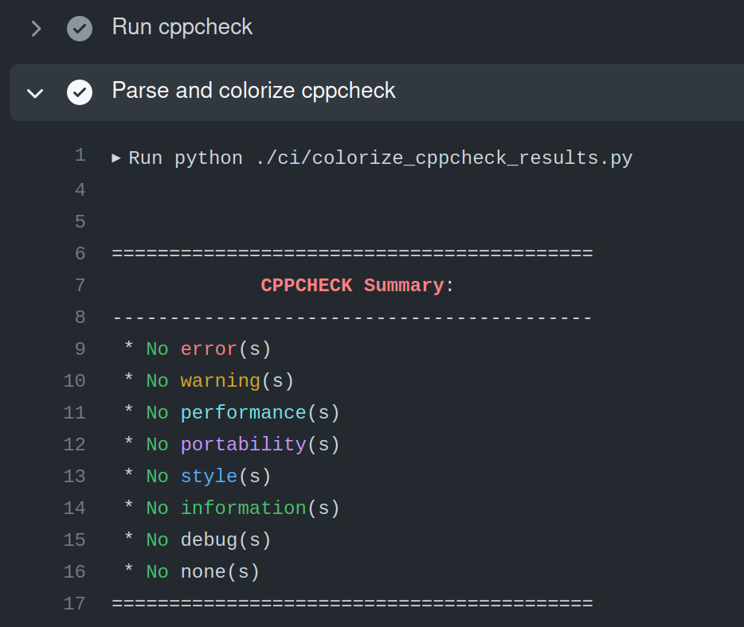

# TestCpp-GHA-Coverage

A repo to test how to report coverage of a C++ project using Github Actions, using https://codecov.io.

See:
* Example PRs [increasing](https://github.com/jmarrec/TestCpp-GHA-Coverage/pull/1) and [decreasing](https://github.com/jmarrec/TestCpp-GHA-Coverage/pull/2) coverage
* the Github Actions workflow at [.github/workflows/build.yml](.github/workflows/build.yml)

----

## Additional

Additionally, it includes a [cppcheck action](.github/workflows/cppcheck.yml) with a custom python script ([ci/colorize_cppcheck_results.py](./ci/colorize_cppcheck_results.py)) I created that will print a summary of offenses and add color to your action.

There is also a [clang-format action](.github/workflows/clang-format-check.yml) that uses the `.clang-format` file in the repo.

(Note: A `.clang-tidy` file is also provided, but I didn't bother adding an action for that.)
